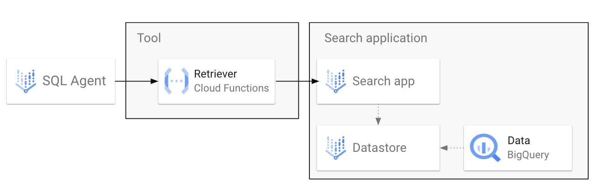
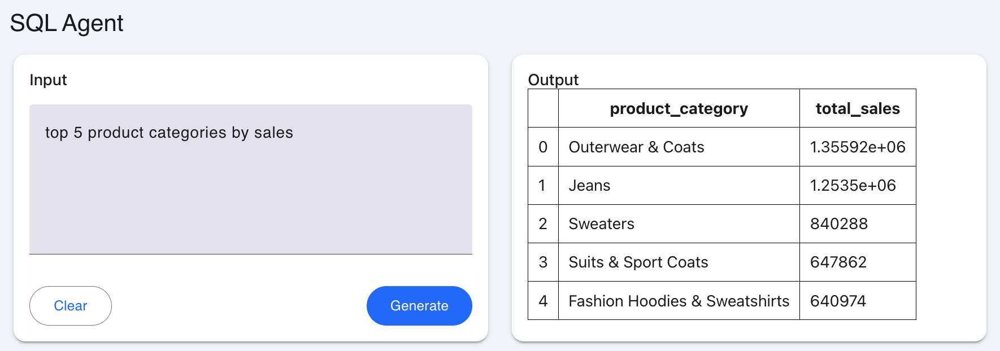

# BigQuery SQL Agent
This directory contains sample code for 1) Connecting a BigQuery dataset to Agent Builder as a tool and also 2) Running a SQL agent as a standalone application (a basic agent if you don't need any other extra functionality).

Watch the tutorial:

[](https://www.youtube.com/watch?v=AsNSxfqsZ2U)

### OPTION 1: Connecting Agent Builder to a BigQuery datastore


### OPTION 2: Using Gemini to convert natural language to SQL and retrieve from BigQuery
With this option, which is recommended for most types of structured data, instead of having a Vertex AI Search application, data is retrieved via SQL query. The SQL is generated by an LLM based on a natural language query.

The flow in this case would look like this: 

1. **Agent -> Tool (Function)**: Runs a NL2SQL function which will prompt Gemini to generate a SQL query given the natural language input
2. **Tool -> BigQuery**: Using the generated SQL query, retrieve the data from BigQuery and return the results to the agent
3. **Agent -> User**: Agent replies back with the full table or a generated response based on instructions.

For this option, a simple mesop app is also included to add a graphical user interface to render Markdown tables:



## Dataset
In the video, I used the [TheLook eCommerce public dataset](https://console.cloud.google.com/marketplace/product/bigquery-public-data/thelook-ecommerce?project=gen-lang-client-0261083003), which you can copy into your own project if you want to follow along.

## Pre-requisites
You need a GCP account with billing enabled and the following IAM roles would be recommended (though it's possible that less permissive roles can still accomplish all the tasks you need):

* Vertex AI Admin
* Discovery Engine Admin
* BigQuery Admin

In addition, the following IAM policies need to be in place:

* (If you're using Agent Builder) The Dialogflow CX service agent needs the Cloud Run invoker role 
* The default Compute Engine service account (or custom service account if you use it for Cloud Functions) need the **BigQuery Job User** and **BigQuery Data Viewer** roles

**Important**: You will need some BigQuery dataset to work with. Either copy the TheLook eCommerce public dataset into your project, or use an existing one. If the latter, then edit the file `function.py` and replace the `TABLE_NAMES` variable with a list of your tables (you must use the fully qualified table names)

## Setup
If you're using Agent Builder (**OPTION 1**), follow the steps in the video. If you're completely new to Agent Builder, I recommend watching [this video](https://www.youtube.com/watch?v=iBiyOl_pH-8) first for the basic setup steps, including IAM setup. 

Pay attention to placeholders and environment variables required in the Cloud Functions and their API specs.

**To run the SQL agent (nl2sql) locally, follow these steps:**

1. Authenticate using gcloud
```
gcloud auth application-default login
```

```
gcloud config set project YOUR_PROJECT_ID
```

You may also need to run:
```
gcloud auth application-default set-quota-project YOUR_PROJECT_ID
```

2. Set environment variable
```
export PROJECT_ID=YOUR_PROJECT_ID
```

3. Create virtual environment and install requirements
```
python3 -m venv venv
. venv/bin/activate
pip install -r requirements.txt
```

4. Run the app
```
mesop main.py
```

Navigate to the localhost URL where the server is running and you'll be able to interact with the agent.

## Contributing
Contributions are welcome! Submit a pull request with any improvements you'd suggest.

## License
See [LICENSE](https://github.com/vmehmeri/generative-ai/blob/main/LICENSE)