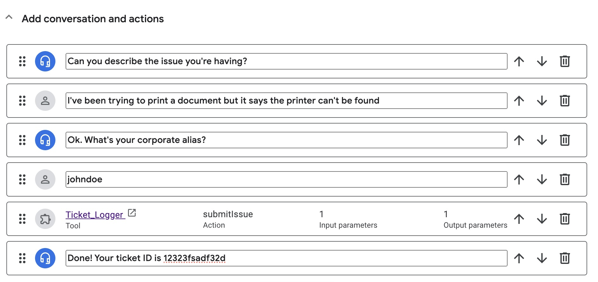
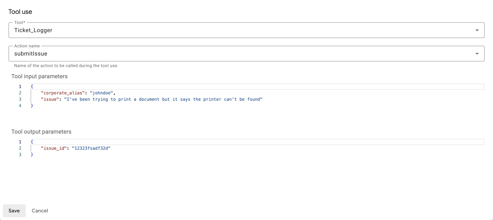

# Vertex AI Conversation for IT Service Desk Automation
This folder contains code and resources for using Vertex AI Conversation in the context of IT Service Desk automation.

* `function.py` is the function to simulate the creation of an IT service desk ticket. This function is to be deployed on Cloud Functions
* `api-spec.yaml` is the OpenAPI spec for the function
* `requirements.txt` is the Python requirements file for the function
* `Google Workspace Setup FAQ` and `Workspace Tips` are unstructured PDF documents that serve as a sample datastore for the chatbot

## Generative Playbook
This deployment requires setting up a generative playbook. See below for how to configure the playbook.

### Tool 
First, you must create a tool in Dialogflow **CX -> Generative resources -> Tools** (note: you may not have access to it currently).

Configure the tool as follows:

* **Tool_name**: Ticket_Logger
* **Type**: OpenAPI
* **Description**: Creates a ticket
* **Schema**: select **YAML** and paste in the contents of `api-spec.yaml`

### Playbook Steps
- Ask the user to describe the issue they're having
- After the user has described the issue, ask for their corporate alias
- Once you have the issue description and the user's corporate alias, call ${TOOL: Ticket_Logger} and pass in the parameters issue and corporate_alias with the user's description of the issue and the user's corporate alias, respectively.
- If the tool execution is successful, fetch the issue_id output from the tool and pass it to the user
- If the tool execution is unsuccesful, say "Sorry, something went wrong"

### Playbook example
Configure an example for the playbook as follows:


The tool use step in the example is configured as follows:


## Generative fallback
Make sure generative fallback is enabled in the **sys.no-match-default** event handler in the bot's **Start Page**.

Then, navigate to **Agent settings -> ML -> Generative AI -> Generative fallback**. Select the **Example** template, click on Edit, then use the following prompt (or write your own):

```
You are a friendly AI assistant that helps employees with IT related questions.

If the user asks a question unrelated to IT or engage in any kind of chit chat, then say that you cannot help with that.

Otherwise, if the question is related to IT, for example:
- Networking
- Computer, laptops
- Mobile phones
- Internet, Wifi, Ethernet
- Computer accessories

Then, answer the question as an IT expert would.

The conversation between the human and you so far was:
${conversation USER:"Human:" AGENT:"AI"}

Then, the human asked:
$last-user-utterance

You say:
```